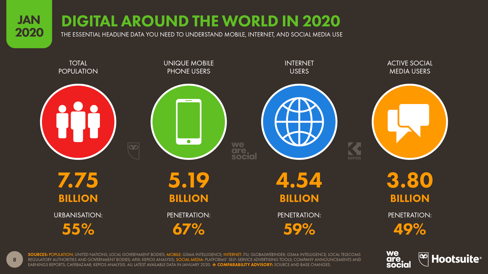
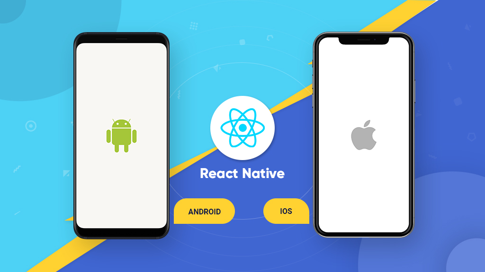
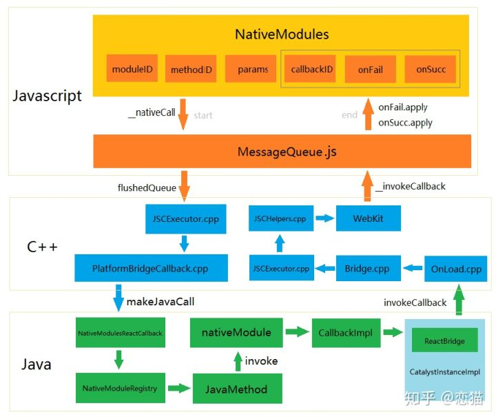
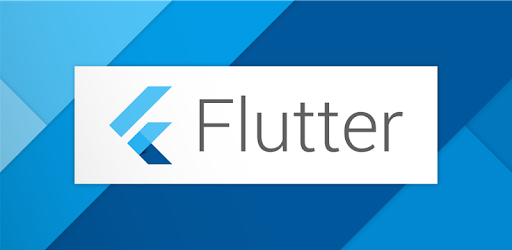
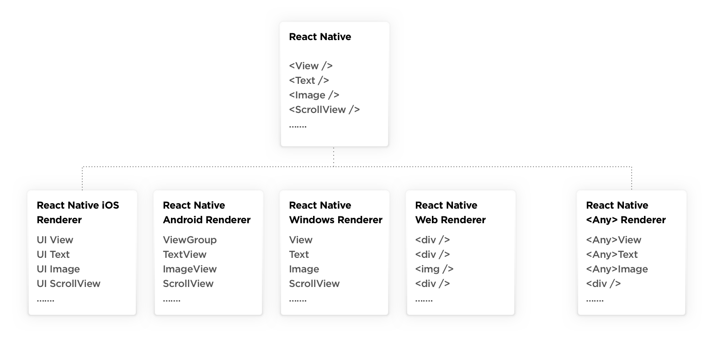
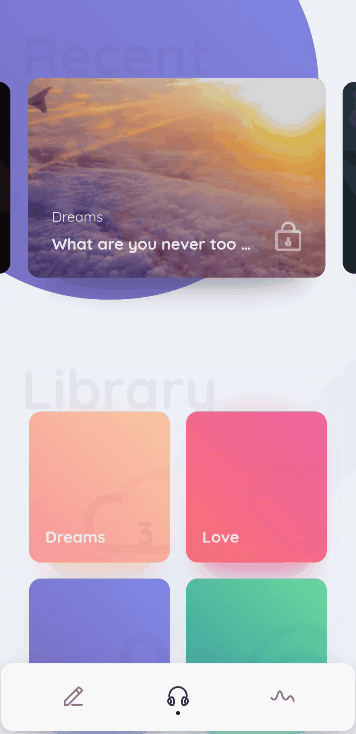
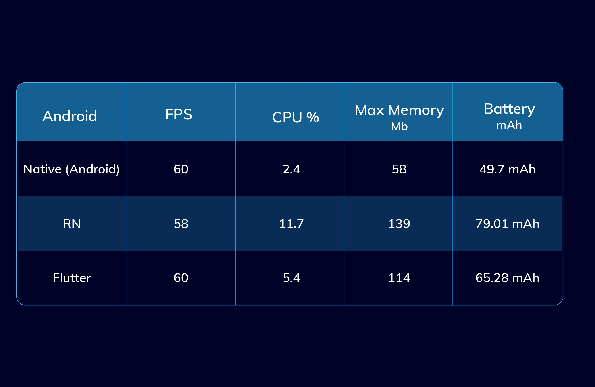

#### Flutter介绍
---

> Flutter 框架是当下非常热门的跨端解决方案，能够帮助开发者通过一套代码库高效构建多平台精美应用，支持移动、Web、桌面等多端开发。但仍然有很多产品、设计、甚至开发同学并不了解 Flutter，所以本文将深入浅出和大家聊聊 Flutter 的设计背景、技术特点，以及与其他同类技术之间的对比，希望与大家一同交流。

#### 跨平台背景

**移动互联网的重要性**

- 与2019年1月相比，全球使用互联网的人数已增加到45.4亿，增长了7％（2.98亿新用户）。
- 到2020年1月，全球有38亿 社交媒体 用户，与去年同期相比，这个数字增长了9％以上（3.21亿新用户）。
- 在全球范围内，现在有超过51.9亿人使用手机，在过去的一年中，用户数量增加了1.24亿（2.4％）。

现在，普通的互联网用户每天在线花费6个小时43分钟。这比去年同期减少了3分钟，但仍然相当于每个互联网用户每年连接时间超过100天。如果我们每天允许大约8个小时的睡眠，那意味着我们目前的醒来时间中，有40％以上是通过互联网度过的。 

在移动互联网的浪潮下，开发效率和使用体验可以说是同等重要。但是，使用原生的方式来开发 App，就要求我们必须针对 **iOS** 和 **Android** 这两个平台分别开发。
因为这样的话，我们不仅需要在不同的项目间尝试用不同的语言去实现同样的功能，还要承担由此带来的维护任务。如果还要继续向其他平台（比如 Web、Mac 或 Windows）拓展的话，我们需要**付出的成本和时间将成倍增长**。而这，显然是难以接受的。于是，跨平台开发的概念顺势走进了我们的视野。
所以从本质上讲，`跨平台开发是为了增加业务代码的复用率，减少因为要适配多个平台带来的工作量，从而降低开发成本`。

#### 跨平台开发方案的三个时代
    
根据实现方式的不同，业内常见的观点是将主流的跨平台方案划分为三个时代。
- Web 容器时代：基于 Web 相关技术通过浏览器组件来实现界面及功能，典型的框架包括 Cordova(PhoneGap)、Ionic 和微信小程序。
- 泛 Web 容器时代：采用类 Web 标准进行开发，但在运行时把绘制和渲染交由原生系统接管的技术，代表框架有 React Native、Weex 和快应用，广义的还包括天猫的 Virtual View 等。
- 自绘引擎时代：自带渲染引擎，客户端仅提供一块画布即可获得从业务逻辑到功能呈现的多端高度一致的渲染体验。Flutter，是为数不多的代表。

##### web容器时代

> Web 时代的方案，主要采用的是原生应用内嵌浏览器控件 WebView的方式进行 HTML5 页面渲染。
> 由于采用了 Web 开发技术，社区和资源非常丰富，开发效率也很高。

但，**一个完整 HTML5 页面的展示要经历浏览器控件的加载、解析和渲染三大过程，性能消耗要比原生开发增加 N 个数量级**。

##### 泛 Web 容器时代

> 泛 Web 容器时代的解决方案优化了 Web 容器时代的加载、解析和渲染这三大过程，把影响它们独立运行的 Web 标准进行了裁剪，以相对简单的方式支持了构建移动端页面必要的 Web 标准（如 Flexbox 等），也保证了便捷的前端开发体验；同时，采用原生自带的 UI 组件实现代替了核心的渲染引擎，仅保持必要的基本控件渲染能力，从而使得渲染过程更加简化，也保证了良好的渲染性能。

> 也就是说，在泛 Web 容器时代，我们仍然采用前端友好的 JavaScript 进行开发，整体加载、渲染机制大大简化，并且由原生接管绘制，即将原生系统作为渲染的后端，为依托于 JavaScript 虚拟机的 JavaScript 代码提供所需要的 UI 控件的实体。这，也是现在绝大部分跨平台框架的思路，而 React Native 和 Weex 就是其中的佼佼者。

**总结起来其实就是利用 JS 来调用 Native 端的组件，从而实现相应的功能。**

##### 自绘引擎时代
> 这一时期的代表 Flutter 则开辟了一种全新的思路，即从头到尾重写一套跨平台的 UI 框架，包括渲染逻辑，甚至是开发语言。
> 1. 渲染引擎依靠跨平台的 `Skia 图形库`来实现，Skia 引擎会将使用 Dart 构建的抽象的视图结构数据加工成 GPU 数据，交由 OpenGL 最终提供给 GPU 渲染，至此完成渲染闭环，因此可以在最大程度上保证一款应用在不同平台、不同设备上的体验一致性。
> 2. 而开发语言选用的是同时支持 JIT（Just-in-Time，即时编译）和 AOT（Ahead-of-Time，预编译）的 Dart，不仅保证了开发效率，更提升了执行效率（比使用 JavaScript 开发的泛 Web 容器方案要高得多）

`Flutter 是什么？它出现的动机是什么，解决了哪些痛点？相比其他跨平台技术，Flutter 的优势在哪里？`

---

##### Flutter 出现的历史背景

为不同的操作系统开发拥有相同功能的应用程序，开发人员只有两个选择：
1. 使用原生开发语言（即 Java 和 Objective-C），针对不同平台分别进行开发。
2. 使用跨平台解决方案，对不同平台进行统一开发。

原生开发方式的体验最好，但研发效率和研发成本相对较高；而跨平台开发方式研发虽然效率高，但为了抹平多端平台差异，各类解决方案暴露的组件和 API 较原生开发相比少很多，因此研发体验和产品功能并不完美。

所以，最成功的跨平台开发方案其实是依托于浏览器控件的 Web。浏览器保证了 99% 的概率下 Web 的需求都是可以实现的，不需要业务将就“技术”。不过，Web 最大的问题在于它的性能和体验与原生开发存在肉眼可感知的差异，因此并不适用于对体验要求较高的场景。

对于用户体验更接近于原生的 React Native，对业务的支持能力却还不到浏览器的 5%，仅适用于中低复杂度的低交互类页面。面对稍微复杂一点儿的交互和动画需求，开发者都需要 case by case 地去 review，甚至还可能要通过原生代码去扩展才能实现。

**带着这些问题，我们终于迎来了本次的主角——Flutter。**

Flutter 是构建 Google 物联网操作系统 Fuchsia 的 SDK，主打`跨平台、高保真、高性能`。开发者可以通过 Dart 语言开发 App，一套代码可以同时运行在 iOS 和 Android 平台。 Flutter 使用 Native 引擎渲染视图，并提供了丰富的组件和接口，这无疑为开发者和用户都提供了良好的体验。

那么，**Flutter 是怎么完成组件渲染的呢**？

这需要从图像显示的基本原理说起。`在计算机系统中，图像的显示需要 CPU、GPU 和显示器一起配合完成：CPU 负责图像数据计算，GPU 负责图像数据渲染，而显示器则负责最终图像显示。`

随后视频控制器会以每秒 60 次的速度，从帧缓冲区读取帧数据交由显示器完成图像显示。

可以看到，Flutter 关注如何尽可能快地在两个硬件时钟的 VSync 信号之间计算并合成视图数据，然后通过 Skia 交给 GPU 渲染：UI 线程使用 Dart 来构建视图结构数据，这些数据会在 GPU 线程进行图层合成，随后交给 Skia 引擎加工成 GPU 数据，而这些数据会通过 OpenGL 最终提供给 GPU 渲染。

##### Skia 是什么？

<u>Skia是一个开源的 2D 图形库，提供各种常用的API，并可在多种软硬件平台上运行。谷歌Chrome浏览器、Chrome OS、安卓、Flutter、火狐浏览器、火狐操作系统以及其它许多产品都使用它作为图形引擎。</u>

Skia `在图形转换、文字渲染、位图渲染方面都表现卓越`，并提供了开发者友好的 API。

因此，架构于 Skia 之上的 Flutter，也因此拥有了彻底的跨平台渲染能力。通过与 Skia 的深度定制及优化，Flutter 可以最大限度地抹平平台差异，提高渲染效率与性能。

底层渲染能力统一了，上层开发接口和功能体验也就随即统一了，开发者再也不用操心平台相关的渲染特性了。`也就是说，Skia 保证了同一套代码调用在 Android 和 iOS 平台上的渲染效果是完全一致的。`

同样的在界面渲染、绘制的过程中，Flutter也做了很多优化处理，提升合成、渲染效率。

##### FLutte的优势

1. 在所有的平台下，都可以保持同样UI样式，同样的业务逻辑。
大多数跨平台框架中的UI呈现：

而Flutter直接通过画在画布上

2. 减少开发所需的时间

-   Flutter的热重载可以高效快速的看到改变，甚至保留应用状态
-   官方提供的各种现成的组件（[Material](https://flutter.dev/docs/development/ui/widgets/material)和[Cupertino](https://flutter.dev/docs/development/ui/widgets/cupertino)）

3. 快速迭代上线

-   不需要单独的是适配iOS、Android双端UI层面的

4. 更接近native的性能表现

- Flutter不依赖任何中间代码，最终直接构建成机器码，提高了性能。

5. 自定义、复杂动画的

- Flutter最大的优势之一就是可以定制你在屏幕上看到的任何东西，不管它有多复杂

6. 自己的渲染引擎

- Flutter使用Skia将界面渲染到平台提供的画布上。（意味着不需调整，迁移到其他平台）

7. 更方便调用native api

- 获取GPS坐标、蓝牙通信、收集传感器数据、权限处理等。（未支持的也可通过platform channel）

8. 更高的潜力

- iOS、Android、Web、Desktop...

---

##### 接下来是相爱相杀时间，我们来对比一下Flutter和React Native(Hippy)。

##### UI方面

- 在新旧设备上也能保持一致

android 5.1  vs android 8.1

- Flutter动画效果

##### 性能方面

- 基于ListView的基准测试

在listView中中，我们有1000个元素，并且到达列表最后一个元素的滚动时间相同，这里使用到了一些第三方库。
- ios Nuke
- Android Glide
- react native React-native-fast-image

结果

##### Flutter缺点

1. 开发者社区的规模和第三方库
2. 持续集成的能力
3. APK的大小
4. Dart语言学习成本
5. 动态更新能力

1. flutter是什么，原理和架构是怎样的

    - 拥有自绘引擎的跨平台开发框架
2. flutter和react-native(hippy)有什么区别，为什么用flutter，不用react-native(hippy)
    
    - 开发效率更高，减少客户端开发时间
    - 性能更优异
    - UI、动画支持更全面
    - 更接近native

3. flutter和react-native(hippy)在方案选型上的一些差异（比如自定义UI组件性能差异，接口怎么通信）
       
    - 自定义UI组件platformview性能有待提升
    - 接口通信，hippy与客户端通过jsbridge，flutter通过methodchannel
4. flutter混合栈的实现(flutter boost)

5. flutter为什么不支持动态更新（或者说我们为什么暂时不支持动态更新）

    - 初期考虑应用安全和苹果策略，所以不支持动态更新
    - 目前Android端可以通过整包方式实现动态更新， iOS 目前还不支持。 
    - QQ团队MXFlutter

6. flutter代码多端复用（包括web，转web，转小程序）
   
   - flutter目前官方支持发布为web应用的能力
   - 京东flutter_mp，PCG flutter转手Q小程序

7. flutter的页面怎么请求后台（dartjce 类似wnsbuffer）

    -   dartjce，在flutter端进行打解包

8. flutter动画能力（lottie? canvas? 序列帧?）

    - lottie - flutter_lottie、fluttie
    - canvas - CustomPainter（官方组件）
    - 序列帧动画 - （官方animation组件）https://verygood.ventures/blog/2020/2/25/a-deep-dive-into-the-flutter-animations-package 