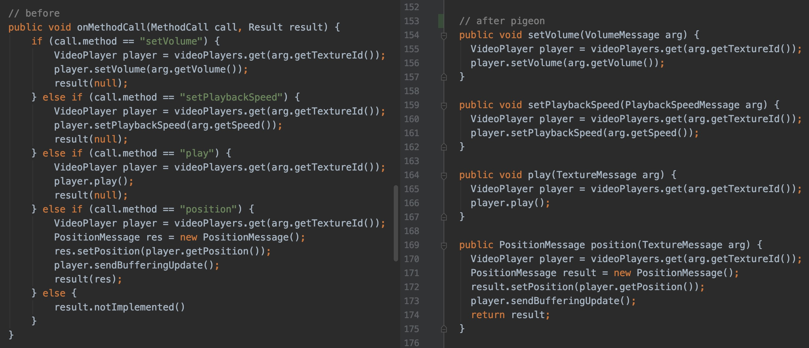
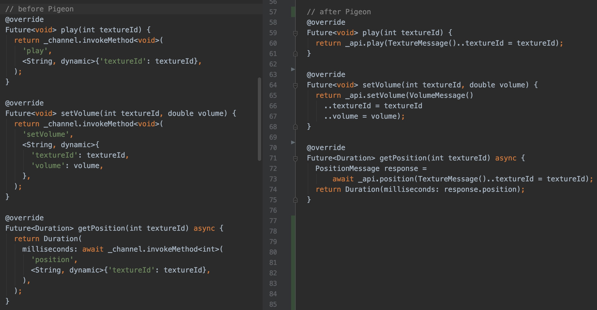

### Flutter插件开发之Pigeon

> Flutter开发中经常会需要用到插件包，而插件包中Android、iOS双端代码如何约束出参入参和规范接口命名，如何跟dart侧实现统一。
> Flutter官方提供了Pigeon插件，通过dart入口，生成双端通用的模板代码，Native部分只需通过重写模板内的接口，无需关心methodChannel部分的具体实现，入参，出参也均通过生成的模板代码进行约束。

[demo源码地址](https://github.com/linpenghui958/flutterPigeonDemo)

warning：目前Pigeon还是prerelease版本，所以可能会有breaking change。下文以0.1.7版本为例。

以Flutter官方plugin中的video_player为例，接入pigeon后最终效果如下


可以看到接入pigeon后整体代码简洁了不少，而且规范了类型定义。接下来我们看一下如何从零接入Pigeon。

#### 创建package

ps：如果接入已有plugin库，可以跳过此部分，直接看接入部分。

执行生成插件包命令：

```
flutter create --org com.exmple --template plugin flutterPigeonDemo
```

要创建插件包，使用`--template=plugin`参数执行`flutter create`

- `lib/flutter_pigeon_demo.dart`
  - 插件包的dart api
- `android/src/main/kotlin/com/example/flutter_pigeon_demo/FlutterPigeonPlugin.kt`
  - 插件包Android部分的实现
- `ios/Classes/FlutterPigeonDemoPlugin.m`
  - 插件包ios部分的实现。
- `example/`
  - 使用该插件的flutterdemo。

这里常规通过methodChannel实现plugin的部分省略，主要讲解一下如何接入pigeon插件。


#### Pigeon接入

先看一下pub.dev上Pigeon的[介绍](https://pub.dev/packages/pigeon)，Pigeon只会生成Flutter与native平台通信所需的模板代码，没有其他运行时的要求，所以也不用担心Pigeon版本不同而导致的冲突。（这里的确不同版本使用起来差异较大，笔者这里接入的时候0.1.7与0.1.10，pigeon默认导出和使用都不相同）


#### 添加依赖

首先在`pubspec.yaml`中添加依赖

```
dev_dependencies:
  flutter_test:
    sdk: flutter
  pigeon:
    version: 0.1.7
```

然后按照官方的要求添加一个pigeons目录，这里我们放dart侧的入口文件，内容为接口、参数、返回值的定义，后面通过pigeon的命令，生产native端代码。

这里以`pigeons/pigeonDemoMessage.dart`为例

```
import 'package:pigeon/pigeon.dart';

class DemoReply {
  String result;
}

class DemoRequest {
  String methodName;
}

// 需要实现的api
@HostApi()
abstract class PigeonDemoApi {
  DemoReply getMessage(DemoRequest params);
}

// 输出配置
void configurePigeon(PigeonOptions opts) {
  opts.dartOut = './lib/PigeonDemoMessage.dart';
  opts.objcHeaderOut = 'ios/Classes/PigeonDemoMessage.h';
  opts.objcSourceOut = 'ios/Classes/PigeonDemoMessage.m';
  opts.objcOptions.prefix = 'FLT';
  opts.javaOut =
  'android/src/main/kotlin/com/example/flutter_pigeon_demo/PigeonDemoMessage.java';
  opts.javaOptions.package = 'package com.example.flutter_pigeon_demo';
}
```

`pigeonDemoMessage.dart`文件中定义了请求参数类型、返回值类型、通信的接口以及pigeon输出的配置。

这里`@HostApi()`标注了通信对象和接口的定义，后续需要在native侧注册该对象，在Dart侧通过该对象的实例来调用接口。

`configurePigeon`为执行pigeon生产双端模板代码的输出配置。

- `dartOut`为dart侧输出位置
- `objcHeaderOut、objcSourceOut`为iOS侧输出位置
- `prefix`为插件默认的前缀
- `javaOut、javaOptions.package`为Android侧输出位置和包名

之后我们只需要执行如下命令，就可以生成对应的代码到指定目录中。

```
flutter pub run pigeon --input pigeons/pigeonDemoMessage.dart
```

- `--input`为我们的输入文件

生成模板代码后的项目目录如下


我们在Plugin库中只需要管理标红的dart文件，其余标绿的则为通过Pigeon自动生成的模板代码。

我们接下来看一下双端如何使用Pigeon生成的模板文件。

#### Android

这里Pigeon生产的`PigeonDemoMessage.java`文件中，可以看到入参和出参的定义`DemoRequest、DemoReply`，而`PigeonDemoApi`接口，后面需要在plugin中继承PigeonDemoApi并实现对应的方法，其中setup函数用来注册对应方法所需的methodChannel。

> ps: 这里生成的PigeonDemoApi部分，setup使用了接口中静态方法的默认实现，这里需要api level 24才能支持，这里需要注意一下。
>
> 考虑到兼容性问题，可以将setup的定义转移到plugin中。

首先需要在plugin文件中引入生成的PigeonDemoMessage中的接口和类。
FlutterPigeonDemoPlugin先要继承PigeonDemoApi。
然后在onAttachedToEngine中进行PigeonDemoApi的setup注册。并在plugin中重写PigeonDemoApi中定义的getMessage方法


伪代码部分

```
// ... 省略其他引入
import com.example.flutter_pigeon_demo.PigeonDemoMessage.*

// 继承PigeonDemoApi
public class FlutterPigeonDemoPlugin: FlutterPlugin, MethodCallHandler, PigeonDemoApi {

	//...
	override fun onAttachedToEngine(@NonNull flutterPluginBinding: FlutterPlugin.FlutterPluginBinding) {
    	channel = MethodChannel(flutterPluginBinding.getFlutterEngine().getDartExecutor(), "flutter_pigeon_demo")
    	channel.setMethodCallHandler(this);
    	// pigeon生成的api进行初始化
    	PigeonDemoApi.setup(flutterPluginBinding.binaryMessenger, this);
  	}
  	
  	// 重写PigeonDemoApi中的getMessage方法
	  override fun getMessage(arg: DemoRequest): DemoReply {
	    	var reply = DemoReply();
	    	reply.result = "pigeon demo result";
	    	return reply;
	}
}

```


#### iOS

ios相关目录下的`PigeonDemoMessage.m`也有`FLTDemoReply、FLTDemoRequest、FLTPigeonDemoApiSetup`的实现。
首先需要在plugin中引入头文件`PigeonDemoMessage.h`，需要在registerWithRegistrar中注册setup函数，并实现getMessage方法。

```
#import "FlutterPigeonDemoPlugin.h"
#import "PigeonDemoMessage.h"

@implementation FlutterPigeonDemoPlugin
+ (void)registerWithRegistrar:(NSObject<FlutterPluginRegistrar>*)registrar {
    FlutterPigeonDemoPlugin* instance = [[FlutterPigeonDemoPlugin alloc] init];
    // 注册api
    FLTPigeonDemoApiSetup(registrar.messenger, instance);
}

// 重写getMessage方法
- (FLTDemoReply*)getMessage:(FLTDemoRequest*)input error:(FlutterError**)error {
    FLTDemoReply* reply = [[FLTDemoReply alloc] init];
    reply.result = @"pigeon demo result";
    return reply;
}

@end

```

#### Dart

最终在dart侧如何调用呢
首先看一下lib下Pigeon生成的dart文件`PigeonDemoMessage.dart`
`DemoReply、DemoRequest`用来实例化入参和出参
然后通过`PigeonDemoApi`的实例去调用方法。

```
import 'dart:async';

import 'package:flutter/services.dart';
import 'PigeonDemoMessage.dart';

class FlutterPigeonDemo {
  static const MethodChannel _channel =
      const MethodChannel('flutter_pigeon_demo');

  static Future<String> get platformVersion async {
    final String version = await _channel.invokeMethod('getPlatformVersion');
    return version;
  }

  static Future<DemoReply> testPigeon() async {
    // 初始化请求参数
    DemoRequest requestParams = DemoRequest()..methodName = 'requestMessage';
    // 通过PigeonDemoApi实例去调用方法
    PigeonDemoApi api = PigeonDemoApi();
    DemoReply reply = await api.getMessage(requestParams);
    return reply;
  }

}

```

至此，Pigeon的接入就已经完成了，这里在demo中使用可能感觉接入Pigeon和常规实现差异不大，我们可以看下一Flutter官方plugin中的video_player接入前后的对比。

左侧为接入Pigeon前，处理逻辑都在onMethodCall中，不同的方法通过传入的call.method来区分，代码复杂后很容易变成面条式代码，而且返回的参数也没有约定，有较多不确定因素。

右侧接入Pigeon后，只需要重写对应的方法，逻辑分离，直接通过函数名区分，只需要关心具体的业务逻辑即可。



而在dart的调用侧，接入前都是通过invokeMethod调用，传入的参数map内也是dynamic类型的值。接入后直接调用api的实例对象上的方法，并且通过Pigeon生成的模板代码，直接实例化参数对象。



总结：通过Pigeon来管理Flutter的plugin库，只需要在dart侧维护一份协议即可，即使在多端协同开发的情况下，也能达到约束和规范的作用。

在实现原生插件时我们可以省去很多重复代码，并且不需要关心具体methodchannel的name，也避免了常规情况下，可能出现的面条式代码，只需通过重写pigeon暴露的方法就可以完成双端的通信。而dart侧也只需要通过模板暴露的实例对象来调用接口方法。

