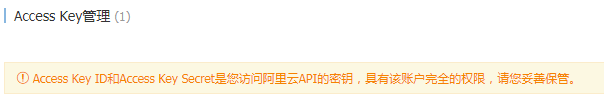
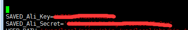

@(Linux)
###acme.sh配置ssl https
---
**使用acme.sh从letsencrypt生成免费证书**
#####1.安装acme.sh
使用root用户安装
> curl  https://get.acme.sh | sh

 
#####2.生产证书
第一种方式，http 方式需要在你的网站根目录下放置一个文件, 来验证你的域名所有权,完成验证. 然后就可以生成证书了.

 
第二种方式，dns 方式, 在域名上添加一条 txt 解析记录, 验证域名所有权.
首先登录你的dnspod账号。生产API ID和Key
例如阿里云

在.acme.sh目录下的account.conf添加id和key

然后使用

	acme.sh --issue --dns -dns_xx -d aa.com
xx对应前面保存在account.conf里面的Ali
然后证书就自动生成了

 
#####copy
注意, 默认生成的证书都放在安装目录下: ~/.acme.sh/,
正确的使用方法是使用 --installcert 命令,并指定目标位置, 然后证书文件会被copy到相应的位置, 例如:

	acme.sh  --installcert  -d  <domain>.com   \
    --key-file   /etc/nginx/ssl/<domain>.key \
    --fullchain-file /etc/nginx/ssl/fullchain.cer \
    --reloadcmd  "service nginx force-reload"

(一个小提醒, 这里用的是 service nginx force-reload, 不是 service nginx reload, 据测试, reload 并不会重新加载证书, 所以用的 force-reload)

Nginx 的配置 ssl_certificate 使用 /etc/nginx/ssl/fullchain.cer ，而非 /etc/nginx/ssl/<domain>.cer ，否则 SSL Labs 的测试会报 Chain issues Incomplete 错误。

 
#####更新acme.sh

	acme.sh --upgrade
	自动升级
	acme.sh  --upgrade  --auto-upgrade
	关闭自动更新
	acme.sh --upgrade  --auto-upgrade  0
 

#####出错了咋办

	acme.sh  --issue  .....  --debug 
	acme.sh  --issue  .....  --debug  2

 
#####最后还需要配置nginx才能生效

ps：如果是在阿里云使用，别忘了配置`安全组`