@(JS基础)
####Eventloop学习
---
##### 为什么会有Event loop
> 因为Javascript设计之初就是一门单线程语言，因此为了实现主线程的不阻塞，Event Loop这样的方案应运而生。
#####先来两题开胃小菜
ps: 没兴趣做题可以跳过直接看结论
- 第一题

	setImmediate(function(){
    console.log(1);
	},0);
	setTimeout(function(){
	    console.log(2);
	},0);
	new Promise(function(resolve){
	    console.log(3);
	    resolve();
	    console.log(4);
	}).then(function(){
	    console.log(5);
	});
	console.log(6);
	process.nextTick(function(){
	    console.log(7);
	});
	console.log(8);
 
		
	结果是： 3 4 6 8 7 5 2 1

- 第二题
	
	console.log('golb');

	setTimeout(function() {
	    console.log('timeout');
	    process.nextTick(function() {
	        console.log('timeout_nextTick');
	    })
	    new Promise(function(resolve) {
	        console.log('timeout_promise');
	        resolve();
	    }).then(function() {
	        console.log('timeout_then')
	    })
	})
	
	setImmediate(function() {
	    console.log('immediate');
	    process.nextTick(function() {
	        console.log('immediate_nextTick');
	    })
	    new Promise(function(resolve) {
	        console.log('immediate_promise');
	        resolve();
	    }).then(function() {
	        console.log('immediate_then')
	    })
	})
	
	process.nextTick(function() {
	    console.log('glob_nextTick');
	})
	new Promise(function(resolve) {
	    console.log('glob_promise');
	    resolve();
	}).then(function() {
	    console.log('glob_then')
	})	

 

	答案：golb
		glob_promise
		glob_nextTick
		glob_then
		timeout
		timeout_promise
		timeout_nextTick
		timeout_then
		immediate
		immediate_promise
		immediate_nextTick
		immediate_then

不知道第二题你是否答对了呢
#####先上结论
v8实现中，两个队列各包含不同的任务

	macrotasks: script(整体代码), setTimeout, setInterval, setImmediate, I/O, UI rendering
	microtasks: process.nextTick, Promises, Object.observe, MutationObserver

##### 执行过程如下：
JavaScript引擎首先从macrotask queue中取出第一任务
执行完毕后，将microtask queue中的所有任务取出，按顺序执行
然后再从macrotask queue中取下一个，
执行完毕后，再次将microtask queue中的全部取出，
循环往复，直到两个queue中的任务都取完

**这里有两个问题， 1、macrotasks中任务的执行顺序 2、process.nextTick和promise.then优先顺序**
 

##### nodejs源码libuv
找到libuv中跟event loop相关的源码
###### src/unix/core.c - uv_run

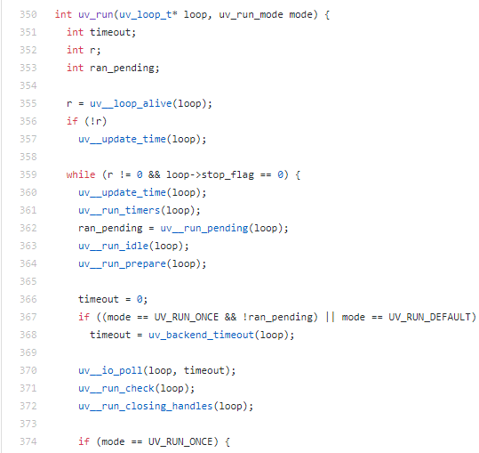

可以看到uv_run方法通过while循环依次运行 `uv__run_timers`、`uv__run_pending`、`uv__run_idle`、`uv__run_prepare`、`uv__io_poll`、`uv__run_check`、`uv__run_closing_handles`
通过这8个函数的执行，实现Event Loop

参考nodejs官网的doc中对Event Loop的概述
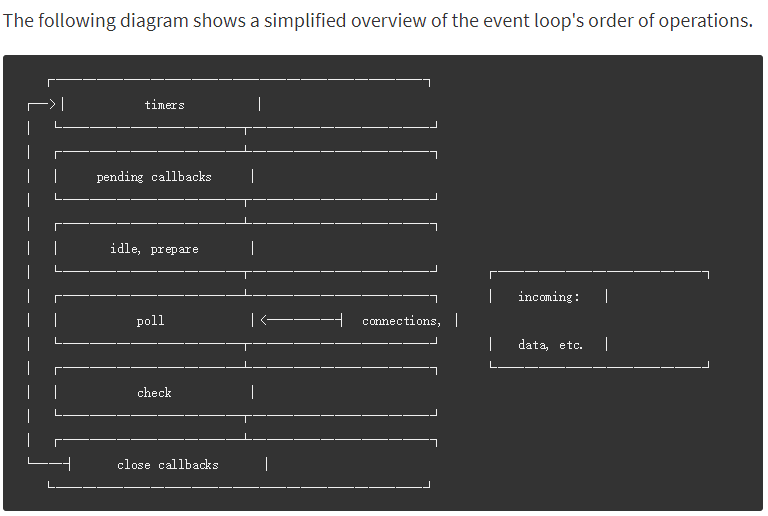

- timers 定时器阶段(setTimeout setInterval) 对应 uv__run_timers
- pending callback  执行某些系统错误的回调 对应 uv__run_pending
- idel, prepare 仅在内部使用
- poll 轮询阶段 对应 uv__io_poll
- check setImmediate在这里执行 对应 uv__run_check
- close 关闭回调 对应 uv__run_closing_handles

这里重点说一下poll阶段（poll阶段会执行到期的定时器回调，处理poll队列中的回调）
当Event Loop进入poll阶段，将会发生以下两种情况
- `如果poll队列不为空的情况下`
Event Loop将会循环同步执行他们的回调，知道队列执行完毕或者系统的硬件限制达到上限

- `如果poll队列为空的情况下`
如果有注册的setImmediate则在该阶段执行完毕后，前往check阶段执行，如果没有则检查是否有timers阶段定时到期的回调，有的话则前往timers阶段执行

`result:` 在Event Loop的6个阶段，从上到下依次轮转，每个阶段都有先进先出的一个**回调队列**，只有当任务队列**执行完毕**或者达到**硬件上限**，才会进入下一个阶段，而每一个阶段之间会**清空**microtask(process.nextTick和promise)，直到运行完所有的队列

##### process.nextTick和Promise
首先我们要知道 process.nextTick, Microtasks 以及 Promise 的 callback 都是通过一个队列 nextTickQueue 调度, 而这一切都是从_tickCallback （ _tickDomainCallback ）开始的。

在Node中，_tickCallback在每一次执行完TaskQueue（macrotask）中的一个任务后被调用
	`_tickCallback中实质上干了两件事`
1. nextTickQueue中所有任务执行掉
2. 第一步执行完后执行_runMicrotasks函数，执行microtask中的部分(promise.then注册的回调)

所以 process.nextTick > promise.then

#### 最后分享一个题目详解
 [参考链接](https://www.jianshu.com/p/12b9f73c5a4f#)
 代码
	
	console.log('golb1');

	setTimeout(function() {
	    console.log('timeout1');
	    process.nextTick(function() {
	        console.log('timeout1_nextTick');
	    })
	    new Promise(function(resolve) {
	        console.log('timeout1_promise');
	        resolve();
	    }).then(function() {
	        console.log('timeout1_then')
	    })
	})
	
	setImmediate(function() {
	    console.log('immediate1');
	    process.nextTick(function() {
	        console.log('immediate1_nextTick');
	    })
	    new Promise(function(resolve) {
	        console.log('immediate1_promise');
	        resolve();
	    }).then(function() {
	        console.log('immediate1_then')
	    })
	})
	
	process.nextTick(function() {
	    console.log('glob1_nextTick');
	})
	new Promise(function(resolve) {
	    console.log('glob1_promise');
	    resolve();
	}).then(function() {
	    console.log('glob1_then')
	})
	
	setTimeout(function() {
	    console.log('timeout2');
	    process.nextTick(function() {
	        console.log('timeout2_nextTick');
	    })
	    new Promise(function(resolve) {
	        console.log('timeout2_promise');
	        resolve();
	    }).then(function() {
	        console.log('timeout2_then')
	    })
	})
	
	process.nextTick(function() {
	    console.log('glob2_nextTick');
	})
	new Promise(function(resolve) {
	    console.log('glob2_promise');
	    resolve();
	}).then(function() {
	    console.log('glob2_then')
	})
	
	setImmediate(function() {
	    console.log('immediate2');
	    process.nextTick(function() {
	        console.log('immediate2_nextTick');
	    })
	    new Promise(function(resolve) {
	        console.log('immediate2_promise');
	        resolve();
	    }).then(function() {
	        console.log('immediate2_then')
	    })
	})
		
这个例子看上去有点复杂，乱七八糟的代码一大堆，不过不用担心，我们一步一步来分析一下。

第一步：宏任务script首先执行。全局入栈。glob1输出。
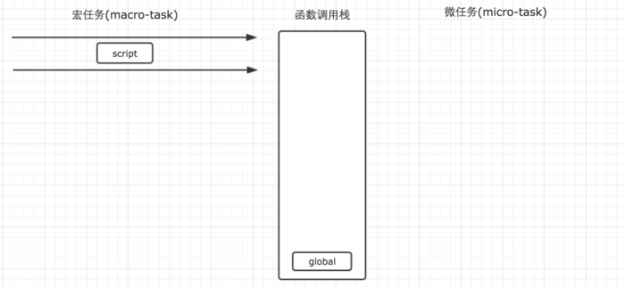
第二步，执行过程遇到setTimeout。setTimeout作为任务分发器，将任务分发到对应的宏任务队列中。
	
	setTimeout(function() {
    console.log('timeout1');
    process.nextTick(function() {
        console.log('timeout1_nextTick');
    })
    new Promise(function(resolve) {
        console.log('timeout1_promise');
        resolve();
    }).then(function() {
        console.log('timeout1_then')
    })
	})

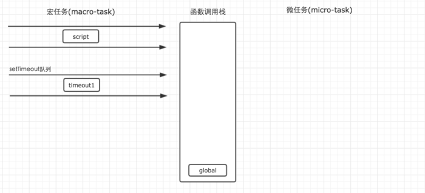
第三步：执行过程遇到setImmediate。setImmediate也是一个宏任务分发器，将任务分发到对应的任务队列中。setImmediate的任务队列会在setTimeout队列的后面执行。

	setImmediate(function() {
    console.log('immediate1');
    process.nextTick(function() {
        console.log('immediate1_nextTick');
    })
    new Promise(function(resolve) {
        console.log('immediate1_promise');
        resolve();
    }).then(function() {
        console.log('immediate1_then')
    })
	})
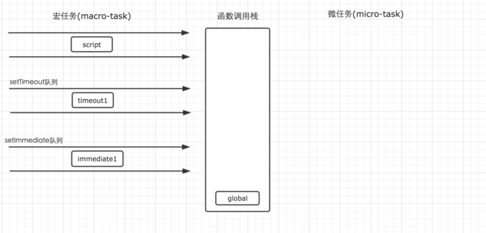
第四步：执行遇到nextTick，process.nextTick是一个微任务分发器，它会将任务分发到对应的微任务队列中去。

	process.nextTick(function() {
    console.log('glob1_nextTick');
	})
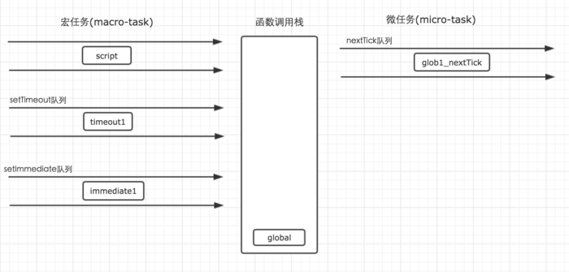
第五步：执行遇到Promise。Promise的then方法会将任务分发到对应的微任务队列中，但是它构造函数中的方法会直接执行。因此，glob1_promise会第二个输出。
	
	new Promise(function(resolve) {
    console.log('glob1_promise');
    resolve();
	}).then(function() {
	    console.log('glob1_then')
	})
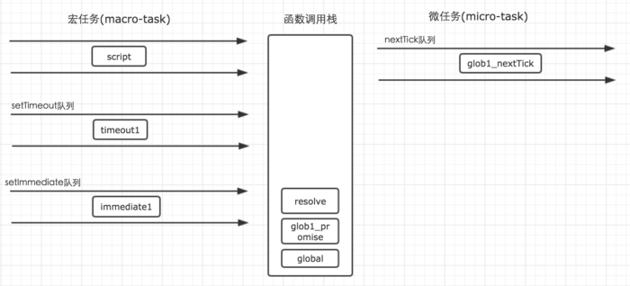
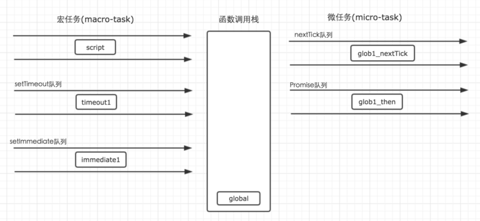
第六步：执行遇到第二个setTimeout。
 
	 setTimeout(function() {
    console.log('timeout2');
    process.nextTick(function() {
        console.log('timeout2_nextTick');
    })
    new Promise(function(resolve) {
        console.log('timeout2_promise');
        resolve();
    }).then(function() {
        console.log('timeout2_then')
    })
	})
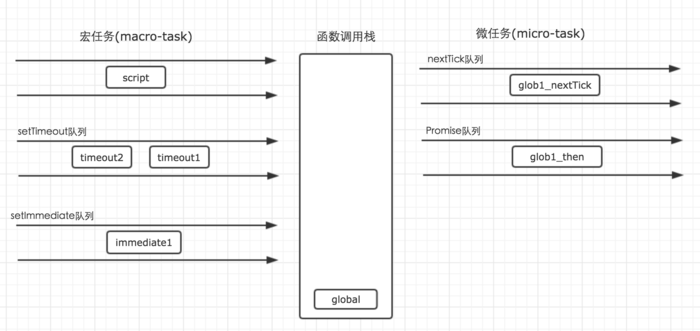
第七步：先后遇到nextTick与Promise

	process.nextTick(function() {
    console.log('glob2_nextTick');
	})
	new Promise(function(resolve) {
	    console.log('glob2_promise');
	    resolve();
	}).then(function() {
	    console.log('glob2_then')
	})
	
第八步：再次遇到setImmediate。

	setImmediate(function() {
    console.log('immediate2');
    process.nextTick(function() {
        console.log('immediate2_nextTick');
    })
    new Promise(function(resolve) {
        console.log('immediate2_promise');
        resolve();
    }).then(function() {
        console.log('immediate2_then')
    })
	})
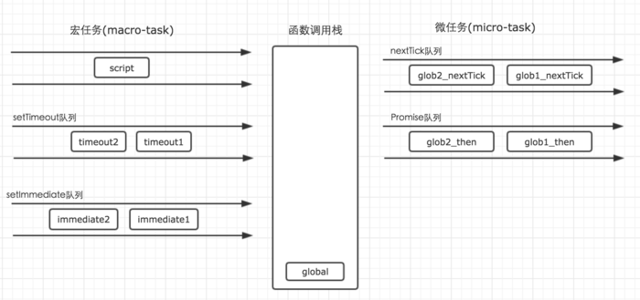
这个时候，script中的代码就执行完毕了，执行过程中，遇到不同的任务分发器，就将任务分发到各自对应的队列中去。接下来，将会执行所有的微任务队列中的任务。

其中，nextTick队列会比Promie先执行。nextTick中的可执行任务执行完毕之后，才会开始执行Promise队列中的任务。

当所有可执行的微任务执行完毕之后，这一轮循环就表示结束了。下一轮循环继续从宏任务队列开始执行。

这个时候，script已经执行完毕，所以就从setTimeout队列开始执行。
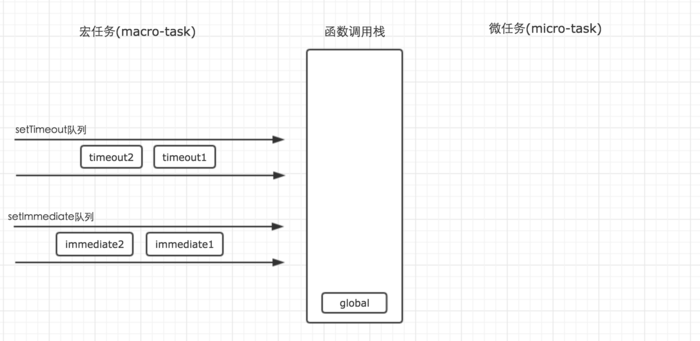
setTimeout任务的执行，也依然是借助函数调用栈来完成，并且遇到任务分发器的时候也会将任务分发到对应的队列中去。

只有当setTimeout中所有的任务执行完毕之后，才会再次开始执行微任务队列。并且清空所有的可执行微任务。

setTiemout队列产生的微任务执行完毕之后，循环则回过头来开始执行setImmediate队列。仍然是先将setImmediate队列中的任务执行完毕，再执行所产生的微任务。

当setImmediate队列执行产生的微任务全部执行之后，第二轮循环也就结束了。